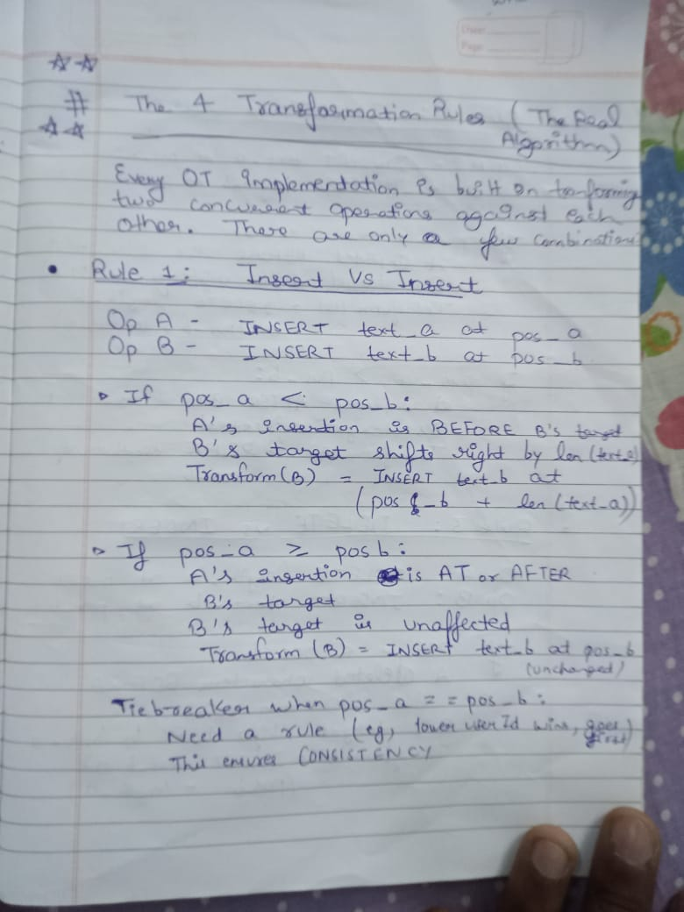
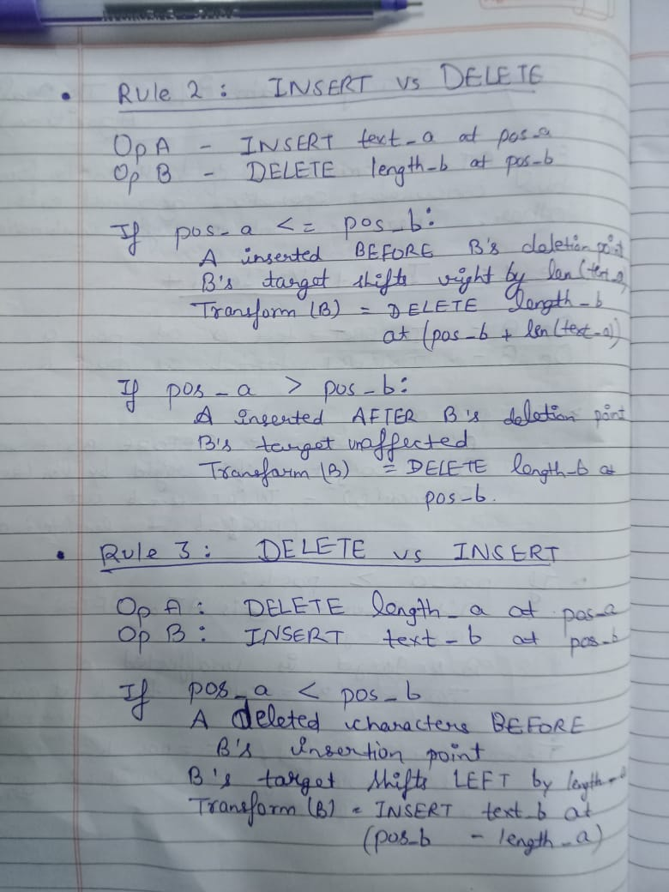
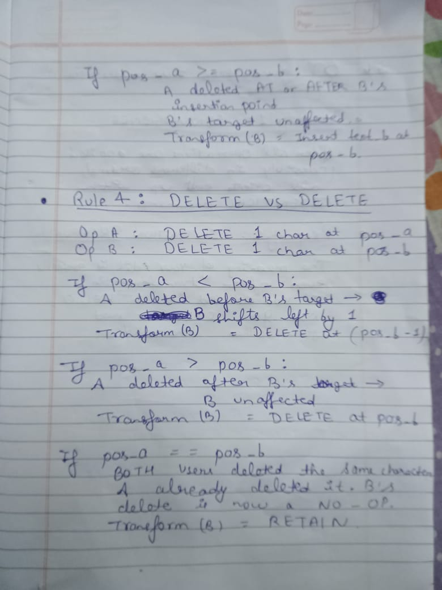
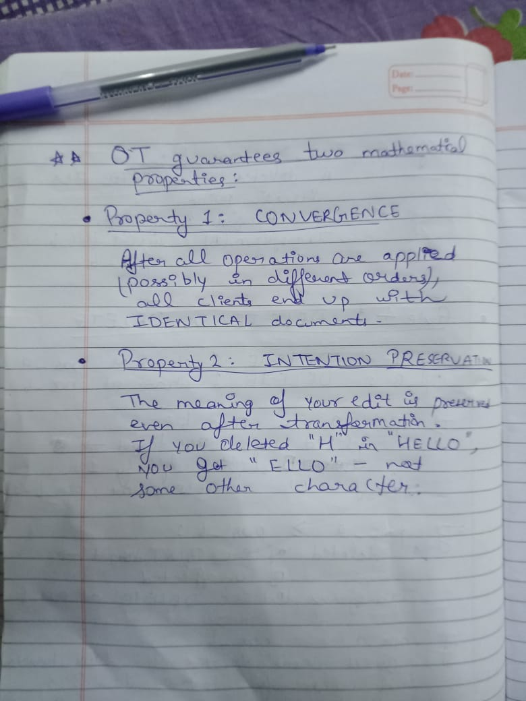

Edge Case 1: The "Black Hole" Deletion

Look at your delete_insert logic.

The Scenario:

    Base Document: 0123456789

    Historical Operation: A user highlights from index 2 to 8 and hits backspace. (position = 2, length = 6).

    Incoming Operation: At the exact same time, you try to insert "X" at index 5.

What your code does:
Your code checks: historical.getPosition() (2) < incoming.getPosition() (5). True!
Then it calculates: incoming.setPosition(5 - 6).
Result: -1.

Your application just crashed with an IndexOutOfBoundsException.

The Fix:
If someone deletes a massive block of text, and you try to type inside that block while it's being deleted, your cursor should simply collapse to the beginning of the deleted block. You need a Math.max boundary.
Java

private static CodeOperation delete_insert(CodeOperation incoming, CodeOperation historical) {
if(historical.getPosition() < incoming.getPosition()){
// If the deletion swallows the incoming cursor, clamp the cursor to the start of the deletion.
int newPosition = Math.max(historical.getPosition(), incoming.getPosition() - historical.getLength());
incoming.setPosition(newPosition);
}
return incoming;
}

Edge Case 2: Double Deletion (The Ghost Edit)

Now look at your delete_delete logic. You correctly handled if they delete at the exact same position. But what if the deletions partially overlap?

The Scenario:

    Historical: Deletes position = 2, length = 5 (Deletes indices 2, 3, 4, 5, 6).

    Incoming: Deletes position = 4, length = 2 (Deletes indices 4, 5).

The historical operation already deleted the text the incoming operation is trying to delete! The incoming operation is swinging at a ghost.

The Fix:
If the incoming delete is entirely swallowed by the historical delete, the incoming operation must be neutralized into a RETAIN operation so it doesn't accidentally delete the next word by mistake.
Java

private static CodeOperation delete_delete(CodeOperation incoming, CodeOperation historical) {
if (historical.getPosition() <= incoming.getPosition()) {

        int histEnd = historical.getPosition() + historical.getLength();
        int incEnd = incoming.getPosition() + incoming.getLength();

        if (histEnd >= incEnd) {
            // The historical deletion completely swallowed the incoming deletion. Neutralize it.
            incoming.setOperationType(OperationType.RETAIN);
            incoming.setLength(0);
        } else {
            // Partial overlap or no overlap, safely shift the starting position left.
            int newPosition = Math.max(historical.getPosition(), incoming.getPosition() - historical.getLength());
            incoming.setPosition(newPosition);
        }
    }
    return incoming;
}

One Minor Improvement

At the very top of your transform method, add a quick bypass for RETAIN. If the historical operation was just someone moving their cursor (RETAIN), the text didn't shift at all, so no math is required.
Java

if (historical.getOperationType() == OperationType.RETAIN) {
return incoming;
}